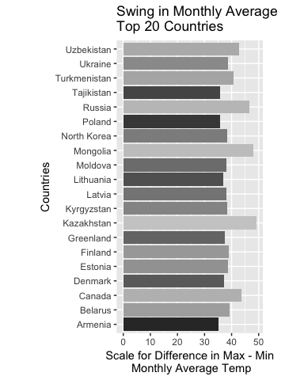

# Data Science and the use of R Case Study 2
Ivelin Angelov, Laura Bishop, Ethan Graham, Scott Gozdzialski  
4-8-2017  


## Introduction
This analysis uses several statistical tools to find the relationship between the age of orange trees and their average circumference, as well as look into the monthly average temperatures cities and land areas.
Each statistical tool has differenct uses.
Some are for analysis of the data, ie. ANOVA, t-test, and linear regressions.
Some are to visualize the data and its characteristics, ie. Scatterplots, box plot, and histograms.
Some are to get to and clean the data, Python, R, and SAS are a few of these tools.
This study is done using R.

## Question 2 of the case study
Using the "Orange" data set built in to R allows for fast and easy analysis of the data.

The table below shows mean and medians of trunk circumference for every tree size.

```r
library(plyr)
library(ggplot2)

# create a new data set with all the samme information as Orange
data1 <- Orange  

#Reorder the Tree size factor to 1, 2, 3, 4, 5
data1$Tree <- factor(data1$Tree, levels(data1$Tree)[c(2,4,1,5,3)])

#Create a function to print just the mean and median of the circumference
myFun <- function(x) {
  c(mean = mean(x), median = median(x))
}

#run the function and format it for a pretty display
cbind(Tree_Size = unique(data1$Tree),do.call(rbind, tapply(data1$circumference, data1$Tree, myFun)))
```

```
##   Tree_Size      mean median
## 1         1  99.57143    115
## 2         2 135.28571    156
## 3         3  94.00000    108
## 4         4 139.28571    167
## 5         5 111.14286    125
```

These data can be plotted using R and ggplot.
The following is a scatterplot of the tree cirumferance vs tree age.
Different symbols represent different size trees.


```r
ggplot(data1, aes(x=circumference, y=age, col=Tree, shape=Tree)) + 
geom_point(size=3)
```

<!-- -->

The following is a group of boxplots, also called a whiskerplots, with the plots in increasing order of maximum tree diameter.

```r
#Reorder the Tree size factor to 3, 1, 5, 2, 4
data1$Tree <- factor(data1$Tree, levels(data1$Tree)[c(3,1,5,2,4)])

#plot the temp data set circumference vs Tree
boxplot(circumference ~ Tree, data = data1, xlab = "Tree number", ylab = "Trunk Circumference (mm)") 
```

<!-- -->

## Question 3 
The main lesson around the Temperature data is manipulating a big data set, date format manipulation, and the split-apply-combine across the data set.

## Country Temperature
For the first part of question 3 (i), the goal is to find the difference between the maximum and the minimum monthly average temperatures for each country.
Then report/visualize top 20 countries with the maximum differences for the period since the year 1900.
The Data is already downloaded to the local R environment, but it must be cleaned.
Cleaning these data consists of manipulating the data into a usable format for easier analysis.

###Data Manipulation for Question 3 (i)
Manipulate and plot the top 20 differences between maximum and minimum temperatures for countries.


```r
#Step 1. Build Data.Frame with rows from 1900-01-01 and greater.
#Read clean data
temp1900 <- read.csv(file.path('data', "TEMP_clean.csv"), colClasses=c("Date", 'numeric', 'character'), sep=',')

temp1900 <- subset(temp1900, Date >= as.Date("1900-01-01"))

#Start the plyr split-apply-combine with difference between country max and min Monthly.AverageTemp. Compute the difference between maximum & minimum temperature and order the result.

df_summarise <- ddply(temp1900, .(Country), summarise,
                      temp_min = min(Temperature), temp_max = max(Temperature))
df_summarise$difference <- c(df_summarise$temp_max-df_summarise$temp_min)

#Order the output and display it
df_ordered <- df_summarise[order(-df_summarise$difference),]
#Skinny down data frame to only what needs to be plotted
df_skinny<- df_ordered[1:20,c(1,4)]
```

### Data Manipulation for Question (ii)
This section focuses on creating a subset of the data for US temperatures after January 1st, 1990 and answering multiple questions in regards to the subset.
The data must be seperated and a row added to the dataframe using a formula.
The result can be confirmed ising basic plotting capablities in R to plot the data.
In section ii, the loop functionality in R is used to condense the data to a different format.

A Farhenheit column in the dataframe is created using a formula for converting Celsuis to Farhenheit.

```r
df_UStemp <- subset(temp1900, Date >= as.Date("1990-01-01") & Country =="United States")
df_UStemp[,4] <- df_UStemp$Temperature * 9/5 +32
colnames(df_UStemp)[4] <- "Fahrenheit"
head(df_UStemp)
```

```
##              Date Temperature       Country Fahrenheit
## 523203 1990-01-01      -1.123 United States    29.9786
## 523204 1990-01-02      -1.747 United States    28.8554
## 523205 1990-01-03       4.465 United States    40.0370
## 523206 1990-01-04       9.380 United States    48.8840
## 523207 1990-01-05      13.772 United States    56.7896
## 523208 1990-01-06      19.780 United States    67.6040
```

Take the new column and Calculate the average land temperture by year, and plot it with temperature on the y axis and years on the X axis.


```r
dates <- as.Date(df_UStemp$Date, "%d-%b-%y")
years <- format(dates, "%Y")
AnnualTemp<-tapply(df_UStemp$Fahrenheit, years, mean)
numyears <- count(years)

plot(numyears[,1], AnnualTemp, xlab="Year", ylab="Annual Temp")
```

<!-- -->

Divide the Temperature averages into two year increaments using a looping function: 1990-1991, 1992-1993, 1994-1995, etc.


```r
j=1 #initialize dataframe row count
control <- dim(AnnualTemp)  #initialize looplimit
df_newtemp<- data.frame(0,0)  #initialize dataframe
for (i in seq (1 , control, 2)){
  df_newtemp[j,1] <- paste(as.character(numyears[i,1]),as.character(numyears[i+1,1]))
	df_newtemp[j,2] = ((AnnualTemp[i] + AnnualTemp[i+1])/2)
	j=j+1
}
colnames(df_newtemp)[1] <- "Years"
colnames(df_newtemp)[2] <- "Average Temp"
df_newtemp # print off dataframe
```

```
##        Years Average Temp
## 1  1990 1991     49.11373
## 2  1992 1993     48.13123
## 3  1994 1995     48.74120
## 4  1996 1997     48.13452
## 5  1998 1999     49.73735
## 6  2000 2001     49.49180
## 7  2002 2003     49.61413
## 8  2004 2005     49.60415
## 9  2006 2007     49.83080
## 10 2008 2009     48.27965
## 11 2010 2011     49.14995
## 12 2012 2013     51.40238
```


##City Temperature
For the third part of question 3,  (iii), the goal is to find the difference between the maximum and the minimum monthly average temperatures for each city listed in the data set.
Then report/visualize top 20 cities with the maximum differences for the period since 1900.

###Data Manipulation for Question (iii)
Manipulate and plot the top 20 differences between maximum and minimum temperatures for cities.


```r
# read the cleaned dataset
CityTemp1900 <- read.csv(file.path('data', "CityTemp_clean.csv"), colClasses=c("Date", 'numeric', 'character', 'character'), sep=',')

# filter only dates over 1990
CityTemp1900 <- subset(CityTemp1900, Date >= as.Date("1990-01-01"))

#Start the plyr split-apply-combine with difference between city max and min Temperature.
dfCity_summarise <- ddply(CityTemp1900, .(City), summarise, temp_min = min(Temperature), temp_max = max(Temperature))

# Compute the difference between maximum & minimum
dfCity_summarise$difference <- c(dfCity_summarise$temp_max-dfCity_summarise$temp_min)

#Order
dfCity_ordered <- dfCity_summarise[order(-dfCity_summarise$difference),]

#Skinny down data frame to only what needs to be plotted
dfCity_skinny<- dfCity_ordered[1:20,c(1,4)]
```

#Analysis of the Country and City Plots
## The Top 20 City & Country Temperature Swings
The variability in Temperature swings, as defined by maximum monthly temperature - minimum monthly temperature, is not as large as one would think.
In the top 20 Countries and Cities with the largest swings since 1900, the variability ranges between 31 and 49 degrees.
For City, in which 50% of the Cities are in China, their is an 18.04 degree average difference.
China, with an average temperature difference of 32.255, did not make the top 20 Countries with the largest difference.
For Country, there is a 13.89 degree difference between the average min and max.
All of the top 20 Countries are located in the northern part of the Northern Hemisphere, with Tajikistan being the southern most Country.
There seems to be a line of further research around temperature change in the northern most Countries of our world and Cities in China.




# Conclusion
So in this case study we have covered some of the capabalites of R and what it can do for upcoming data sciencetists.  We have used the built in data set and showed some of the statistical capablities of R by calculating the mean and medain of different orange tree trunks.  We showed some of the ploting capabilities by showing a scatterplot and boxplot on the orange tree dataset.  We have also shown the capabilities or R to download and clean large data sets easily by finding the differnet max and min monthly average temperature for the top countries with the greatest swing in temperature.  Then we cut the dataset down nd add a new column using a formula, we plotted the new dataset based on yearly means with at basic plot function.  We used a loop to cut the smaller data set down to two year increments.  And finally we downloaded, cleaned , and manipulated the temperature max and mins for the top twenty cities with the highest greatest temperature swing and compared it graphically against the top twenty countries. As you can see R is a versitial tool to be in your toolbox as you move on in you data science career.
